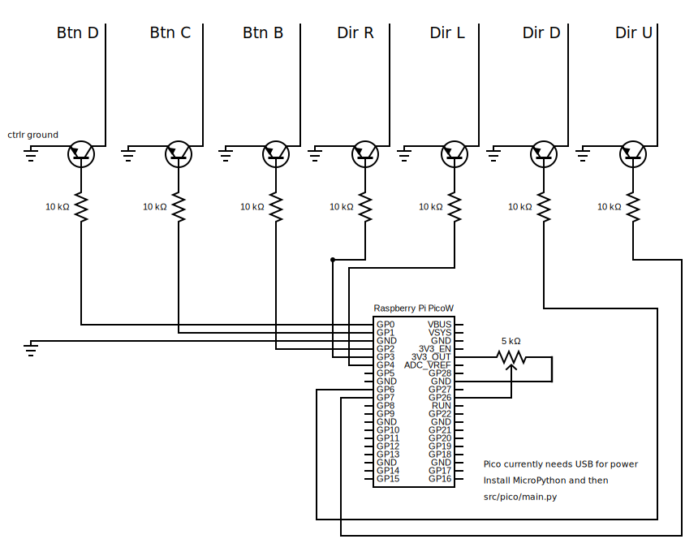

# Raspberry Pi Pico

A Pico can be used to build the controller. This folder contains the schematic and a MicroPython program for doing that.

## Pico Issues

The Pico's ADC (analog to digital converter) is not the best. So when using a Pico, you can get "jitter" at certain angles. It is mostly smooth, the jitter only comes up in a few places.

If the jitter bothers you, I recommend using an Arduino instead (check the `arduino` folder next to this one).

## Schematic

